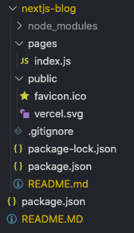

###### Setup

##### Setup

1) From target project folder, run either:

- if you encounter an error with the install, run `npm init` before re-attempting installation

    ~~~ bash
    npx create-next-app nextjs-blog --use-npm --example "https://github.com/vercel/next-learn-starter/tree/master/learn-starter"

    ~~~

   - the following file setup will be  created

        

2) Launch the default  `Next.js` app using  either:
   
   ~~~ bash
   npm run dev
   ~~~